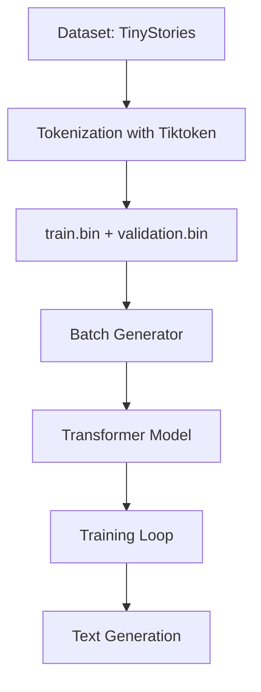
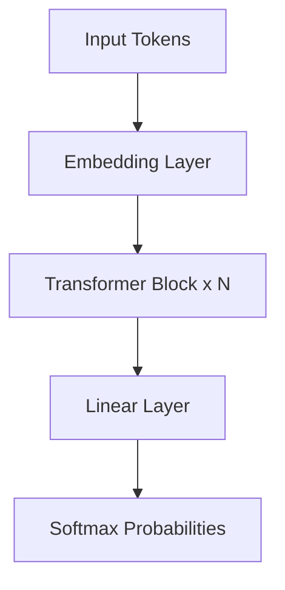

# Small Language Model (SLM)

A **Small Language Model (~50–60M parameters)** built from scratch using **PyTorch** and trained on the **TinyStories dataset**. This project is inspired by nanoGPT and demonstrates how to build, train, and generate text with a transformer-based architecture.

---

## 📌 Project Overview

* **Goal:** Train a small transformer language model that can generate short, coherent, and creative stories.
* **Dataset:** [TinyStories](https://huggingface.co/datasets/roneneldan/TinyStories) → Synthetic dataset of simple stories for children.
* **Frameworks:** PyTorch, HuggingFace Datasets, Tiktoken.
* **Model Size:** ~50–60 million parameters.

---

## 🚀 Features

* Load and preprocess dataset with HuggingFace `datasets`
* Tokenize using OpenAI's **tiktoken GPT-2 tokenizer**
* Store tokenized data in efficient **memmap files (`train.bin`, `validation.bin`)**
* Define a **Transformer-based SLM** with configurable block size, layers, heads, etc.
* Train with **GPU acceleration (CUDA)**
* Generate new stories with the trained model

---

## 🛠️ Installation

```bash
# Clone the repository
git clone https://github.com/yourusername/SLM.git
cd SLM

# Install dependencies
pip install -r requirements.txt
```

**requirements.txt**:

```
torch
numpy
tiktoken
datasets
tqdm
```

---

## 📂 Project Structure

```
SLM/
│── SLM.ipynb           # Main notebook (training + generation)
│── requirements.txt    # Dependencies
│── train.bin           # Tokenized training dataset
│── validation.bin      # Tokenized validation dataset
│── README.md           # Project documentation
```

---

## 🔄 Workflow



---

## 🧩 Model Architecture

* **Embedding Layer** → Convert tokens to vectors
* **Transformer Blocks** (Multi-Head Attention + Feedforward + LayerNorm)
* **Output Layer** → Predict next token



---

## 📊 Training

* Context window (block size): **configurable**
* Optimizer: **AdamW**
* Loss: **Cross-Entropy**
* Device: Supports **CPU / GPU (CUDA)**

---

## 📝 Usage

Run the notebook:

```bash
jupyter notebook SLM.ipynb
```

Inside, you can:

1. Train the model
2. Generate text using trained weights

Example text generation:

```python
prompt = "Once upon a time"
generated_text = model.generate(prompt, max_new_tokens=50)
print(generated_text)
```

---

## 📈 Example Output

*Input Prompt:* `Once upon a time`

*Generated Story:*
`Once upon a time there was a little dog. The dog liked to play and run. One day he found a ball and made a new friend...`

---

## 🤝 Contributing

Pull requests are welcome! For major changes, please open an issue first to discuss what you’d like to change.

---

## 📜 License

This project is licensed under the **MIT License**.

---

## 🌟 Acknowledgements

* [nanoGPT](https://github.com/karpathy/nanoGPT) for inspiration
* [TinyStories dataset](https://huggingface.co/datasets/roneneldan/TinyStories)
* OpenAI's [tiktoken](https://github.com/openai/tiktoken) tokenizer

